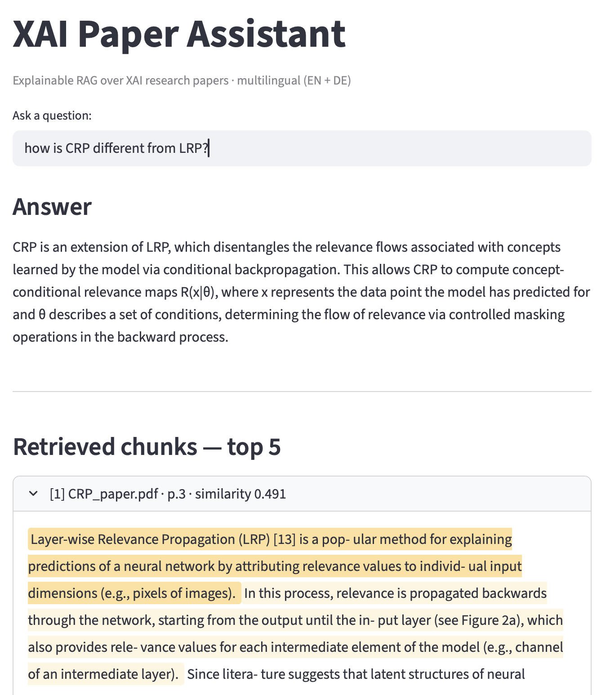
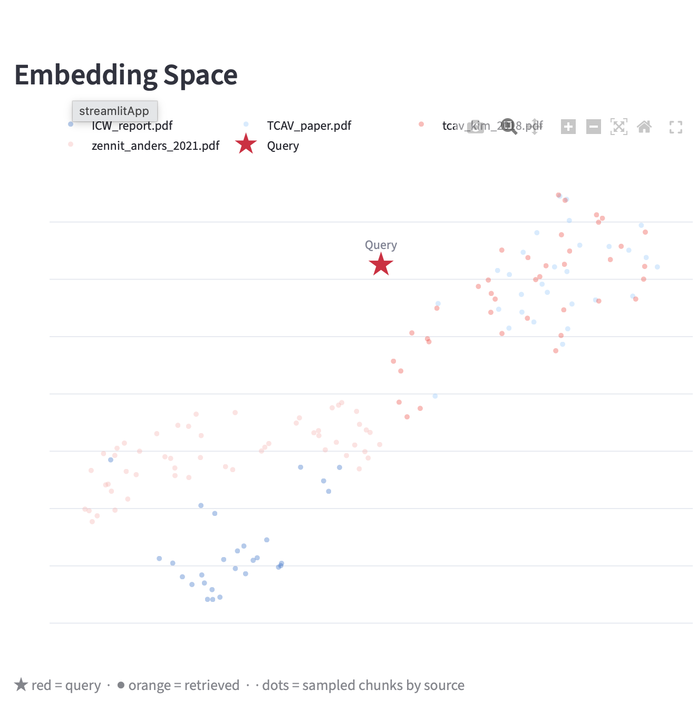

# Concept Pruning — FP2 / ICW 2 [](https://xai-concept-pruning-mitoses-ug7bxicybwkp7mu5yj8pwa.streamlit.app/)

HTW Berlin · Master Applied Informatics · Ilona Eisenbraun · Oct 2022
Full report: [`docs/ICW_report.pdf`](docs/ICW_report.pdf)

---

## XAI Paper Assistant — Live Demo

**[→ Open app](https://xai-concept-pruning-mitoses-ug7bxicybwkp7mu5yj8pwa.streamlit.app/)**

An explainable RAG pipeline that lets you query the CRP paper, this coursework report, and related XAI literature — and shows *why* each chunk was retrieved, not just *which* chunks.

<table>
<tr>
<td></td>
<td></td>
</tr>
<tr>
<td align="center"><em>Query - answer - sentence heatmap - keyword overlap</em></td>
<td align="center"><em>Query point in the embedding space</em></td>
</tr>
</table>

| Feature                        | What it shows                                         |
| ------------------------------ | ----------------------------------------------------- |
| **UMAP embedding space** | Where your query lands relative to all indexed chunks |
| **Sentence heatmap**     | Which sentences inside each chunk are most relevant   |
| **Keyword overlap**      | Shared concepts between query and retrieved text      |

Multilingual: English queries correctly retrieve German chunks from the report (`paraphrase-multilingual-MiniLM-L12-v2`).

**Run locally:**

```bash
pip install -r rag/requirements_rag.txt
export GROQ_API_KEY=your_key   # free at console.groq.com
streamlit run rag/app.py
```

**Stack:** LlamaIndex · ChromaDB · UMAP · Groq (llama-3.1-8b-instant) · Streamlit

---

## Research Overview

Investigates which **concepts** a VGG-based mitosis classifier (CBMI, HTW Berlin) learns and relies on — using **Concept Relevance Propagation (CRP)** [Achtibat et al., 2022] via `zennit-crp`. CRP extends LRP to attribute decisions to individual convolutional filters, enabling layer-by-layer inspection of learned representations.

Part of a series:

| Coursework                  | Topic                                                           |
| --------------------------- | --------------------------------------------------------------- |
| ICW 1 — LRP Pruning        | Network pruning guided by Layerwise Relevance Propagation       |
| ICW 1 — ProtoPNet          | Interpretable classification via learned prototypes             |
| **ICW 2 (this repo)** | **Concept attribution and concept-level pruning via CRP** |

### Key Findings

- **Middle/high layers are decisive.** `features.25`, `classifier.0`, `classifier.3` carry the highest per-concept relevance (up to ~1.06 for concept 370 in `features.25`).
- **Lower layers are uniform, not irrelevant.** The same concept IDs recur with max vote counts (40/40 samples) in `features.0`, `features.4` — stable texture encodings rather than discriminative concepts.
- **Concepts decompose hierarchically.** Top concepts in `features.22` trace back to a coherent cluster of sub-concepts in `features.18`.
- **Spatial consistency.** Centre-masked local analysis closely matches the global latent atlas — the network's mitosis representations are centred on the actual mitotic structure.

**Implication for pruning:** Concept-level pruning below `features.22` risks removing cross-class features. Pruning at `features.22` and above targets genuinely class-specific encodings.

---

## Project Structure

```
.
├── main.py                      Entry point: data loading, fine-tuning, evaluation
├── requirements.txt
├── modules/
│   ├── concept_attribution.py   Latent, local, and decomposition attribution
│   ├── concept_pruning.py       Mask-based pruning of selected concept filters
│   ├── concept_visualization.py Heatmap generation and composite image rendering
│   ├── lamb.py                  LAMB optimiser (self-contained)
│   └── utils.py                 Sparsity measurement, attribution variable init
├── analysis/                    Jupyter notebooks (CocoX, model_crp)
├── outputs/
│   ├── true_attributions/       Heatmaps — mitosis class
│   └── false_attributions/      Heatmaps — non-mitosis class
├── docs/
│   ├── ICW_report.pdf
│   ├── seminar.tex              LaTeX source (pdfLaTeX + BibTeX)
│   └── images/
└── rag/                         XAI Paper Assistant
    ├── app.py
    ├── pipeline.py
    └── explain.py
```

---

## Installation

```bash
pip install -r requirements.txt
```

Place `state_dict.pth` and `examples_ds_from_MP.train.HTW.train/` in the project root, then:

```bash
python main.py
```

---

## Technical Upgrades (`modernize` branch)

Original: Python 3.8 / PyTorch 1.12 / Pillow 9.2

| Change                                                                             | Reason                                                 |
| ---------------------------------------------------------------------------------- | ------------------------------------------------------ |
| `__main__.py` → `main.py`; `imp` → `from modules.lamb import Lamb`       | `imp` removed in Python 3.12                         |
| `modules/lamb.py` — self-contained LAMB optimiser                               | Removes dependency on absolute path to another machine |
| `softmax(..., dim=1)`                                                            | Required since PyTorch 1.5                             |
| `torch.load(..., weights_only=False)`                                            | Explicit flag required in PyTorch 2.6+                 |
| `collections.abc.Mapping`                                                        | `collections.Mapping` removed in Python 3.10         |
| `Image.LANCZOS`                                                                  | `Image.ANTIALIAS` removed in Pillow 10.0             |
| `font.getbbox()`                                                                 | `font.getsize()` removed in Pillow 10.0              |
| `next(iter(dict.keys()))`                                                        | `dict.keys()[0]` not valid in Python 3               |
| `device=module.weight.device`                                                    | Replaces hardcoded `device='cuda:0'`                 |
| All flat files →`modules/`, notebooks → `analysis/`, outputs → `outputs/` | Standard ML project structure                          |

---

## Dependencies

| Package       | Original | Modernized |
| ------------- | -------- | ---------- |
| torch         | 1.12.0   | ≥ 2.0.0   |
| Pillow        | 9.2.0    | ≥ 10.0.0  |
| zennit        | 0.4.7    | ≥ 0.4.6   |
| zennit-crp    | 0.4.2    | ≥ 0.6.0   |
| numpy         | 1.22.4   | ≥ 1.24.0  |
| opencv-python | 4.6.0    | ≥ 4.7.0   |

---

## References

- Achtibat et al., *"From 'Where' to 'What': Towards Human-Understandable Explanations through Concept Relevance Propagation"*, arXiv:2206.03208, 2022.
- Anders et al., *"Software for Dataset-wide XAI: From Local Explanations to Global Insights with Zennit"*, CoRR abs/2106.13200, 2021.
- Yeom et al., *"Pruning by Explaining: A Novel Criterion for Deep Neural Network Pruning"*, CoRR, 2019.
